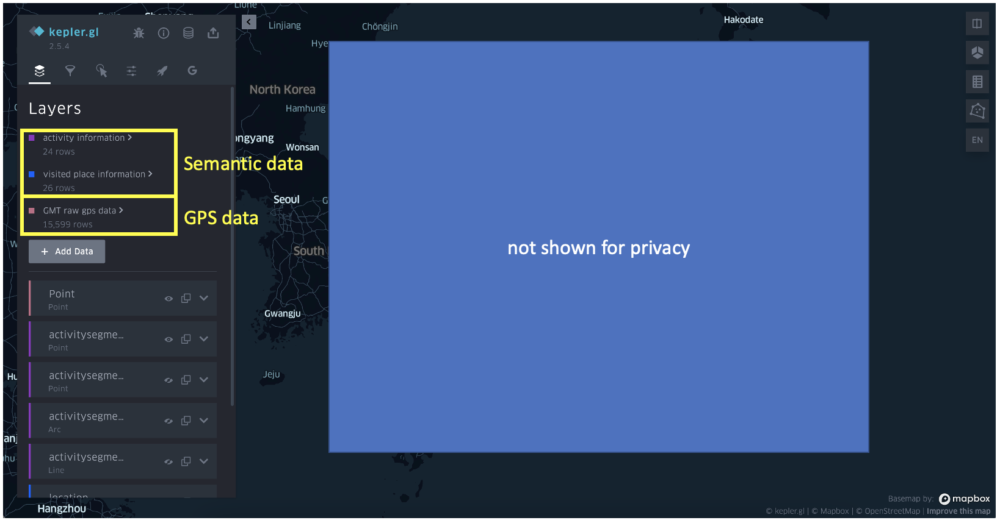

# Enhanced Kepler.gl for JISMesh Visualization

This [demo](https://natsuapo.github.io/keplerjis) is an extension of the [work](https://www.researchgate.net/publication/357023205_Enhancing_Keplergl_for_processing_Google_Maps_Timeline_data) published in ICC 2021. The demo includes two new features:
- Meshcode data visualization;
- Meshcode aggregation visualization;

In this demo, the following functions are available:
- Loading Google takeout data;
- Field deleting;

#### Notes:
  - For other functions. The demo will be prepared later.
  - Currently, the enhanced part is only in English, the Japanese version will be established later.
  - You will need internet to load the base map.

## Usage

### JISMesh Visualization:
- For meshcode based aggregation, choosing JIS(ID) layer type. Basically, the system can detect meshcode field.
  - Loading spatial data -> Choose layer type **JIS(ID)**
  
  - The system can automatically detect the field meshcode for data visualization, for other field name, you need to choose it in the item selector.
   

- The JisMesh layer extends column layer, so it is able to load big jismesh for visualization. However, the boundary will be automatically generalized (like what is shown above) for reducing memory usage, but if you zoom in, you will find the accurate bounds for each grid.
  - When loading big jismesh, the loading part will take time while moving viewport the rendering is rather smooth.

### JISMesh aggregation:
- For point data in Japan, choosing JIS(Agg) layer type.
  - Loading spatial data -> Choose layer type **JIS(Agg)**
  

- You can moving slider to change the mesh size.
  - Meshcode is computed by [jismesh](https://github.com/yoshizow/jismesh-js) package.
  - Current support Mesh Level 1 (1次メッシュ) to Mesh Level 6 (6次メッシュ)
  - Mesh level 3:
  
  - mesh level 4:
  

### Google takeout data loading:
- This demo also supports google takeout data loading and visualizing.
  - Support loading both google gps data and google semantic data;
     - For sementic data: two data sources will be generated;
     - For GPS data: one datasource;
  

### Field deleting:
- After opening the data table of a specific datasource.You can choose to delete any field.
  

### (Update 2022/1/18) Base map of 国土地理院, OSM and Carto Dark
- The updating include:
  - Make it possible for Kepler.gl to handle the tiles that are not in Mapbox format.
  - Change the default base map and view port settings and make it easier for Japanese user to use.
- Adding processing panel (Beta)
  - The processing functions are still under debugging, so currently using processing function is not recommended. 

### implementation:
~~Currently Mapbox access token is provided by the author, but it would be better to add your own Mapbox access token to line 40~~

In the new version, mapbox is not anymore utilized for map visualization. Instead, we add the support for several open tiles such as the base map provided by 国土地理院 and open street map.

