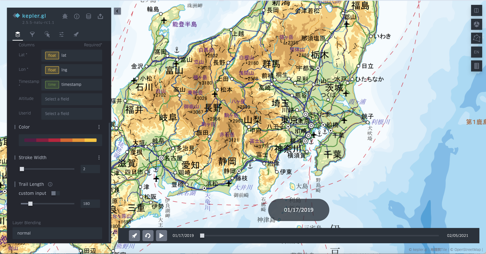

# Google Maps Timeline

Google maps timeline (GMT) is a special data format provided by Google. The extension of Kepler.gl for Google Maps Timeline is introduced in the [previous work published on ICC 2021](https://www.researchgate.net/publication/357023205_Enhancing_Keplergl_for_processing_Google_Maps_Timeline_data).

Basically, there are two types of GMT data, the raw location history is converted to a table with coordinates named `GMT raw gps data`, and a point layer is automatically generated for visualizing the coordinates.

Since it meets the column requirement of trajectory data, user can directly convert point layer to trajectory layer. (I am considering to make it a trajectory layer by default)

The semantic location history file is converted two data sources, which are respectively activity information` representing the OD data of the user, and `visited place information` representing the stay point data. Then several layers are auto generated, among which the stay points are converted to a point layer while the origin-destination pairs are converted to an arc layer.

