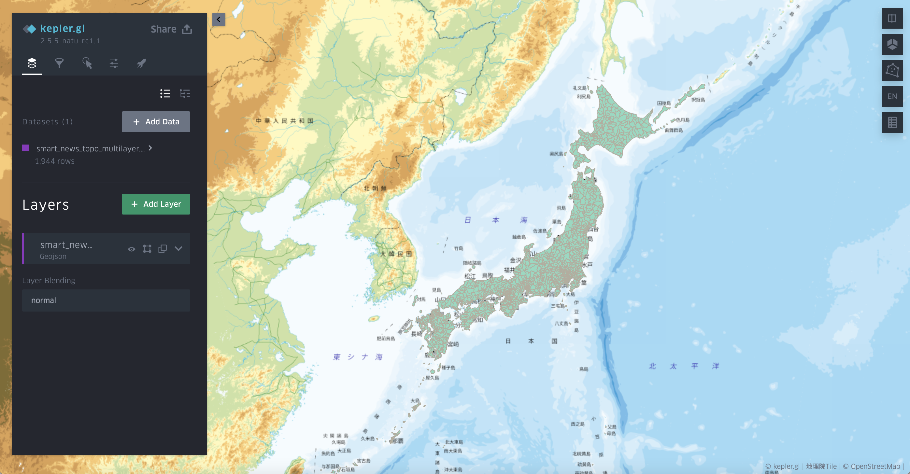
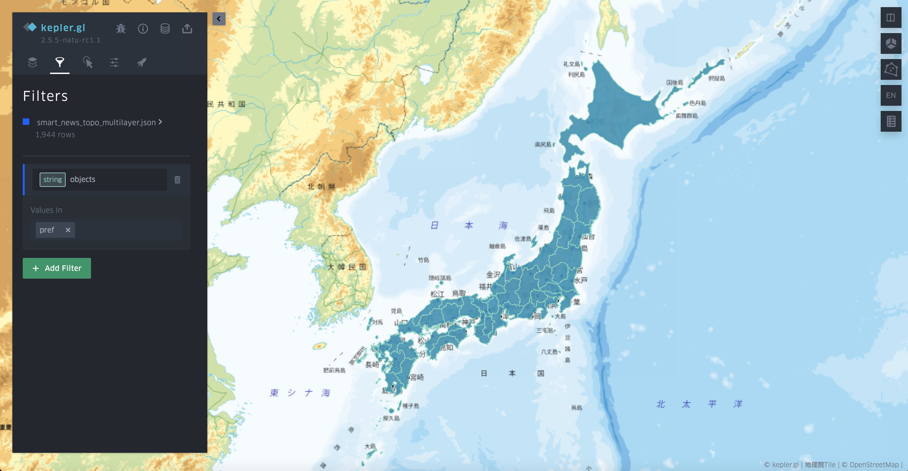

# TopoJSON

TopoJSON is an enhanced type of GeoJSON that keeps the information of topology and requires less storage.  

In the current enhanced system, TopoJSON data will be loaded as one Polygon layer regardless of their objects. In the GeoJSON layer (in original it is called Polygon layer, but it can visualize lines and points in GeoJSON), a new column representing the object name will be added to distinguish the elements in each object.

Here is an example of visualizing [a TopoJSON file of Japanese cities and prefectures adapted from the smartnews TopoJSON](https://raw.githubusercontent.com/natsuapo/keplerjis/main/smart_news_topo_multilayer.json).

In the data table, you can find the object information in the column `object`. And you can filter the `object` by the name.

