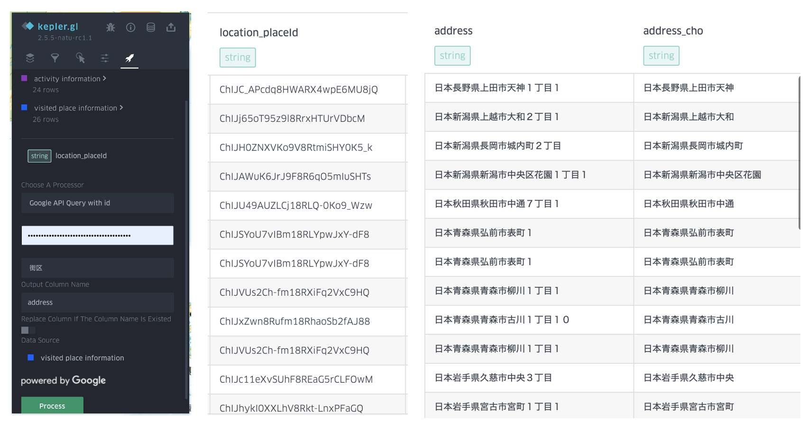

# Address related functions

Address related functions include those functions that modify address data, geocoding, and generate address data with coordinates (reverse geocoding) or other information (API). Since there is no column type of address, all address related functions are available in the item list of `string` type columns. 

Not like other data processing which can be conducted offline, most of the address related functions need to call API to get extra data.

In this system, the address related functions mainly use Google API and aims to process Google related data (e.g. GMT data). Since google API does not support CORS, in the previous research and demo I built a simple server to forward Google API results, which might against the terms of use of Google API if I open it in the demo. **So in the current stage, the address related functions, especially those using Google API, are out of service in the demo app**. 

Nevertheless, I have the plan to make some functions offline, and make the API request part more flexible, so as the users can request the data from their own server.

## Address query using Google API with place ID

This function takes the input of google place ID column, and call Google place API to get the address information. In addition, user need to input the API token for query. Notice that google does not allow users to save place information instead of place ID. So this function is only used for visualization, or modify the result of GMT data (I assume that since GMT data is provided by Google, it should be OK to modify it without against terms of use).

The demo of this function requires users to input the level of administrative area and the access token. Then the query result will be downloaded and stored in the `datacontainer`. The figure shows an example of using this function with the settings, here I created two columns with different levels of administrative regions.

