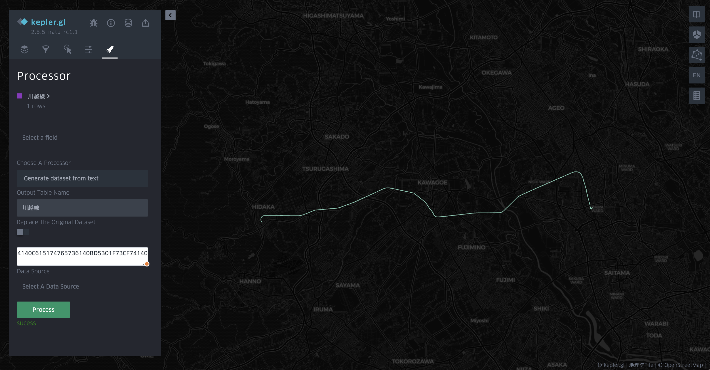
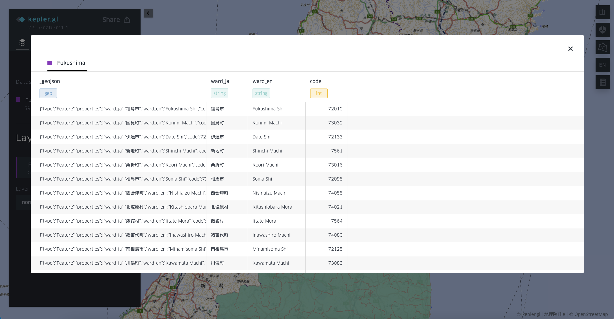

# Generate dataset from text

This function is to make it easier for user to paste any data from other data sources. It does not need any input of data source to use this function, instead, it will generate a simple dataset based on the text input by users.

To use this function, paste any valid **WKB/WKT/GeoJSON** data into the input box, and set the data source name (optional).

After paste the data and click the `process` button, a data source, and a related GeoJSON layer will be automatically generated. In the current version, the map view will not be changed after the layer generated. You can use [zoom to layer](https://natsuapo.github.io/keplerjis/interaction-main#zoom-to-layer-function) to set the map view. 

Kawagoe line with the input of WKB

For GeoJSON data, it will be processed with the same output as the GeoJSON file, which means a data source with multiple rows and attribute columns. Here is an example of pasting the geojson data of [Fukushima prefecture](https://raw.githubusercontent.com/dataofjapan/land/master/fukushima.geojson).

**Hint**: A collaborative application of this function with other functions in Kepler.gl is to get a data source from the geometry user draw in Kepler.gl.

