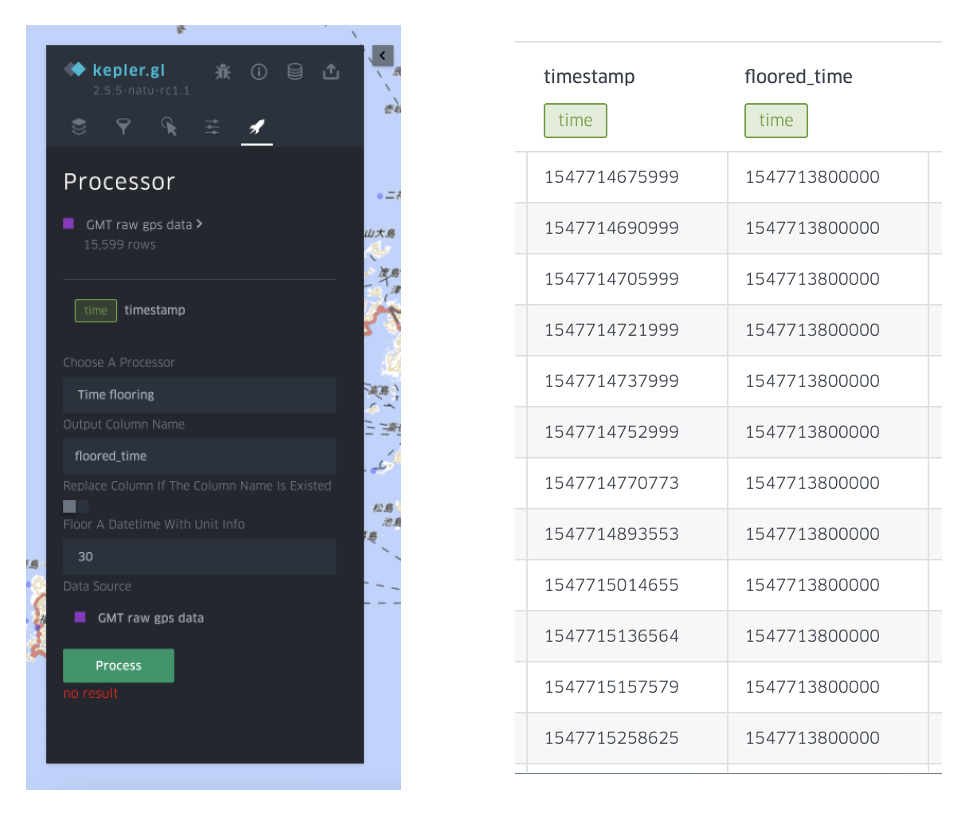

# Temporal data processing functions
{:.no_toc}

Temporal data processing functions aim to modify the time information (mainly for indexing and desensitization), or merge / filter multiple data sources with time information.

In the current system, the following processing functions are available: 

## Time flooring
{:toc}

Time flooring is utilized to floor the time information to the unit that users define (e.g. one hour flooring would make all time within 12:00:00~12:59:59 to 12:00). This function is for index the data for aggregation, or desensitize the time that a user visited some places (especially for GPS/GMT data). The following image is an example of the parameter setting and the conducted result. 

