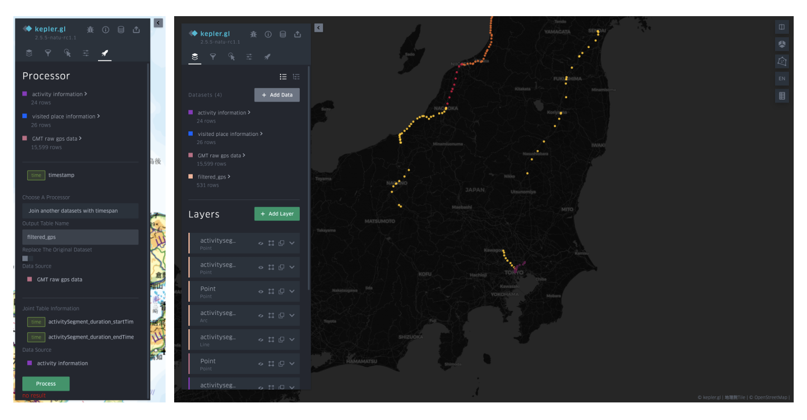

# Temporal data processing functions
{:.no_toc}

Temporal data processing functions aim to modify the time information (mainly for indexing and desensitization), or merge / filter multiple data sources with time information.

In the current system, the following processing functions are available: 

## Time flooring
{:toc}

Time flooring is utilized to floor the time information to the unit that users define (e.g. one hour flooring would make all time within 12:00:00~12:59:59 to 12:00). This function is for index the data for aggregation, or desensitize the time that a user visited some places (especially for GPS/GMT data). The following image is an example of the parameter setting and the conducted result. 

### Join another dateset with time span
This is a function for masking temporal data with multiple time windows. To use this function, you need to set the temporal data column of the selected data source, and the start time column, end time column of the joint data source. Then it will extract all rows from the target source with the timestamp between the start time and the end time, and assign other attributes of the joint data source. 

A general use case is assuming we have the information of several big events with the start time and end time, we can use this function to extract the temporal data only during the big events. The following figure show another use case with GMT data: for GMT semantic data (OD) and GMT raw data (GPS), we can use this function to extract the trajectories only during the OD, and assign semantic information to the extracted GPS points.

