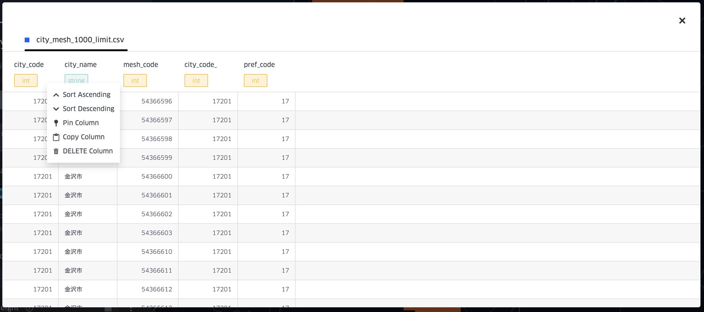

# Interaction functions
{:.no_toc}

Interaction enhancement aims to improve the effectiveness of user manipulation. Notice that some interactions also contains data processing. (for processing functions in data processing side panel, please refer to the processing section)

1. TOC
{:toc}

## Zoom to layer function

Zoom to layer function is a basic function in desktop GIS tools for user to reset map view. 

In this system, a zoom to layer button is added for each layer in the layer configurator. Anytime when users click the button, the map view will be returned to the layer extent.  

## Field deleting function

After opening the data table of a specific data source, user can choose to delete any field. 

-

