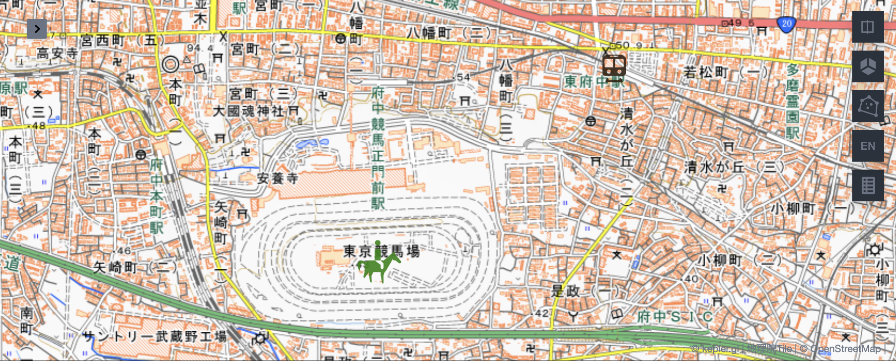

# Icon layer

Kepler.gl provides an icon layer for visualizing point objects as 162 icons. However, it lacks some important icons for trajectory analysis, such as train and plane. On the other hand, Maki is an open map icon library provided by Mapbox in SVG format, which has far more icons than Kepler.gl and even includes the icons that meet Japanese map icon standard. Unfortunately, as a web.gl based application, Kepler.gl use a compressed triangulated data structure to represent icon data, and it is impossible for kepler.gl to directly load SVG icons.

Nevertheless, after reading the data structure of icons in Kepler.gl, this system successfully added extra 205 icons adapted from Maki for icon visualization. These adapted icons are available in the [open source repository](https://github.com/natsuapo/kepler-maki-icon), and the icons will be requested at the same time together with the original Kepler icons.  

Here is an example of visualizing the `horse-riding` icon and `train` icon from Maki in enhanced Kepler.gl.

