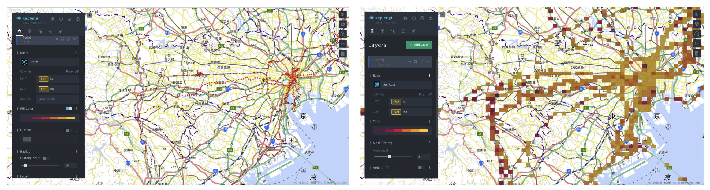
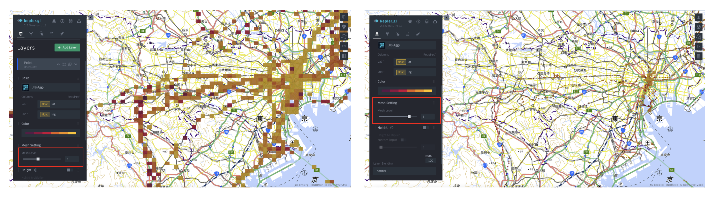

# Mesh aggregation layer

Mesh aggregation layer is inspired by Grid Layer. This layer takes point as input. Similar to grid layer, mesh aggregation layer extends from aggregation layer, and can automatically aggregate the points into each mesh and compute the statistic result based on the attributes. Mesh aggregation layer is powerful in visualizing mesh density without preprocessing the points. In addition, it can be shifted to different levels and re-rendered immediately.  

To use mesh aggregation layer, users just need to shift a point layer to the JIS(agg) layer. Then the points will be aggregated to mesh level-3 by default. 

To shift the mesh level, users just need to move the slider of mesh level.

