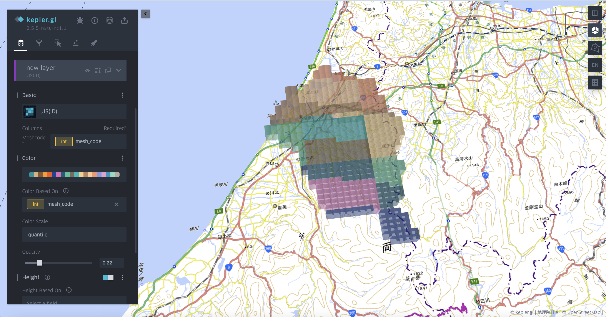
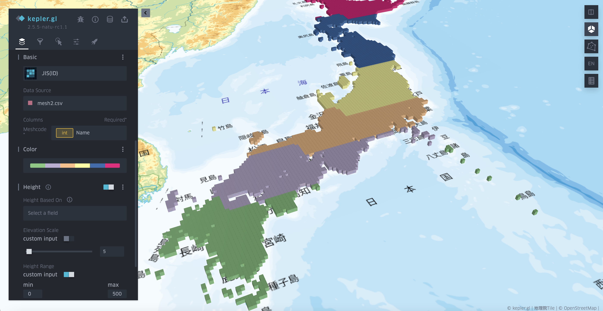

# Mesh code layer

Mesh code layer is inspired by Hexagon Layer. It takes mesh code ID as input. It is powerful for visualizing mesh code based statistic than polygon layer as it does not require the input of a mesh polygon, which can save a lot of space for data storage.

Figure shows an example of using mesh code layer in mesh level-3. When using mesh code layer, user need to choose the layer type of JIS(ID) and then define the mesh code column. 

Here is an example of visualizing the meshes in a national scale. The data size is reduced to 1/25 when shifting GeoJSON to a CSV file without geometry information.

**Note**: currently there are still some bugs in the sidebar setting part.