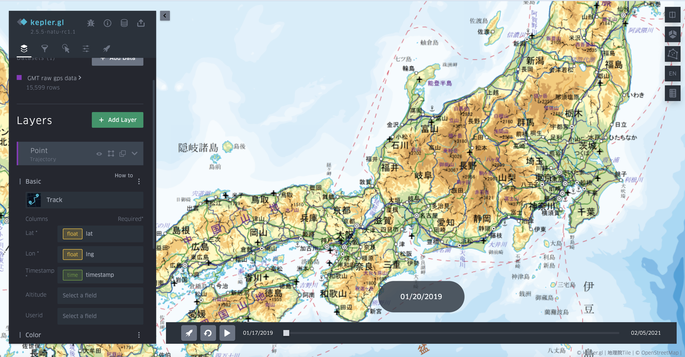

# Trajectory layer

Trajectory layer shares the similar visualization results with trip layer, but it is simpler in data input format as it requires a general GPS file with user ID (can be omitted), longitude, latitude and timestamp. The input data source will be converted to the trip layer data format with the aggregation of each user's trajectories. If user ID is omitted, then all trajectories will be aggregated into one record. After the parameters are set, a slider with be visualized in the map for animation and current time control.

Since the data is aggregated and processed once the layer is initialized, it has several limitations such as the unavailability of filtering (data could be filtered, but cannot interact with trajectory animation), color setting based on fields etc. I will try to fix these issues in the future development.  

