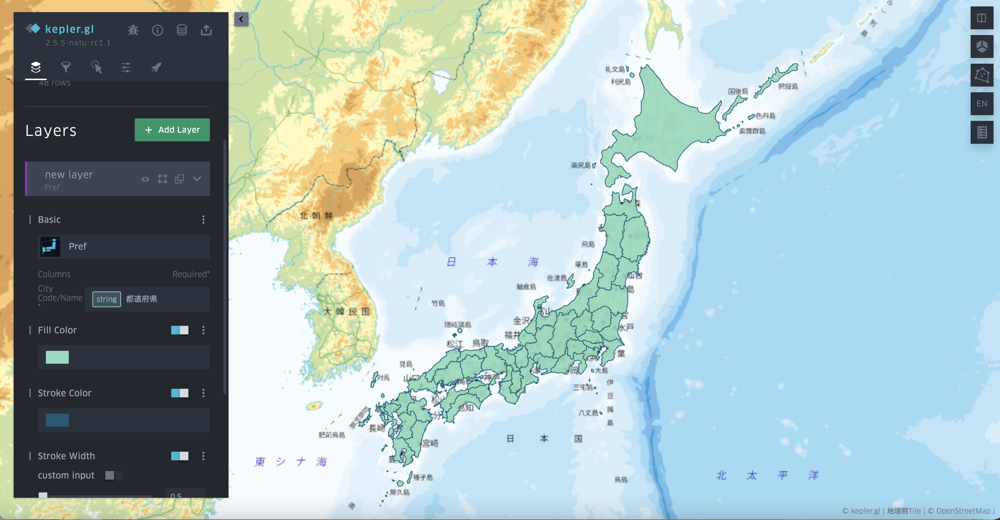

# Prefecture layer (Region polygon layer)

Prefecture layer is for visualizing simple statistic result in each preloaded prefecture polygons without the requirement of geometry information in the data source. This layer is designed for two scenarios: 

The first scenario is to directly visualize statistic results without input any prefecture layer. This feature can help analyzers doing visualization without input the polygon data. This is a powerful function in combination with the data source downloaded via URL, or the prefecture data extracted via some processing functions.  

The second scenario is for dashboard or fast visualization with data in server side. It requires less data-transferring volume between frontend and backend than directly uploading the whole geometry data.  

To use this layer with any CSV files including the prefecture name, users just need to select prefecture name column, then the prefecture geometry will be directly rendered. Other settings of this layer are similar to those of Polygon layer.

In the future, this layer will be extended to all standard polygon layer that user can build the polygon path by themselves.
